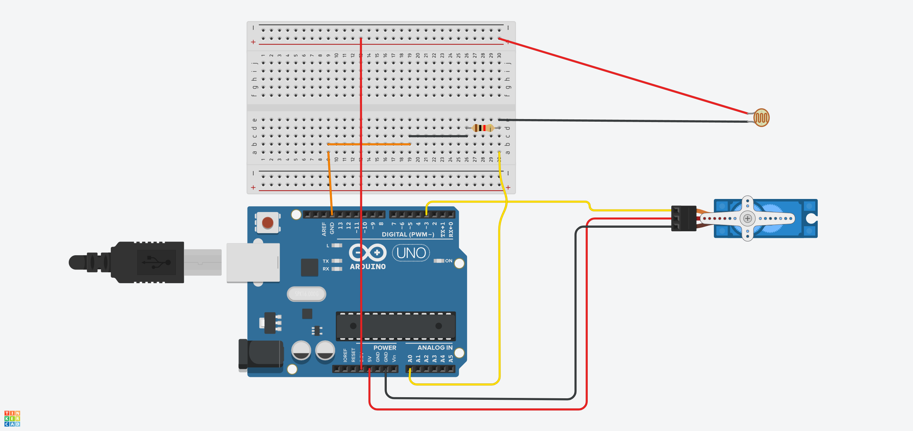

# Single-axis light tracker
This project is an assignment for one of my university courses.

The purpose of this assignment is to implement a single-axis light tracking system using an Arduino board. The code provided in the `light-tracker.ino` file is responsible for controlling the behavior of the system.

The algorithm should use a light sensor to detect the intensity of light and adjust the position of a servo motor accordingly. The servo motor should move in the direction of the light source, ensuring that the photoresistor is pointed at the light source.

Test code for this project is available in `servo-test.ino` and `photoresistor-test.ino`. These two files help testing that the photoresistor is working and that the servo is controlled as expected. The main `light-tracker.ino` file is a few iterations ahead of both, but the concepts remain the same. 

# Setup 
To build the code onto an Arduino board, I used the VS Code extension. 

1. Open the main directory. Ensure that it is named "light-tracker". Otherwise, the Arduino extension won't generate the `c_cpp_properties.json` file.
2. Run the command `Arduino: Initialize`.
3. Select `light-tracker.ino` as the base file
4. Select your Arduino board. In my case I'm using an Arduino Uno.

## Import `servo.h`
You need servo.h to control the servo, at least using this code. You can probably control it manually with varying PWM signal outputs, but this is easier.

1. Run the command `Arduino: Library Manager`
2. Search for `servo` and install `Servo by Michael Margolis, Arduino`
3. Run the command `Arduino: Rebuild IntelliSense Configuration`. This loads the new servo.h library so you won't get squiggly red lines in VS Code.

You can now upload the code to your board.